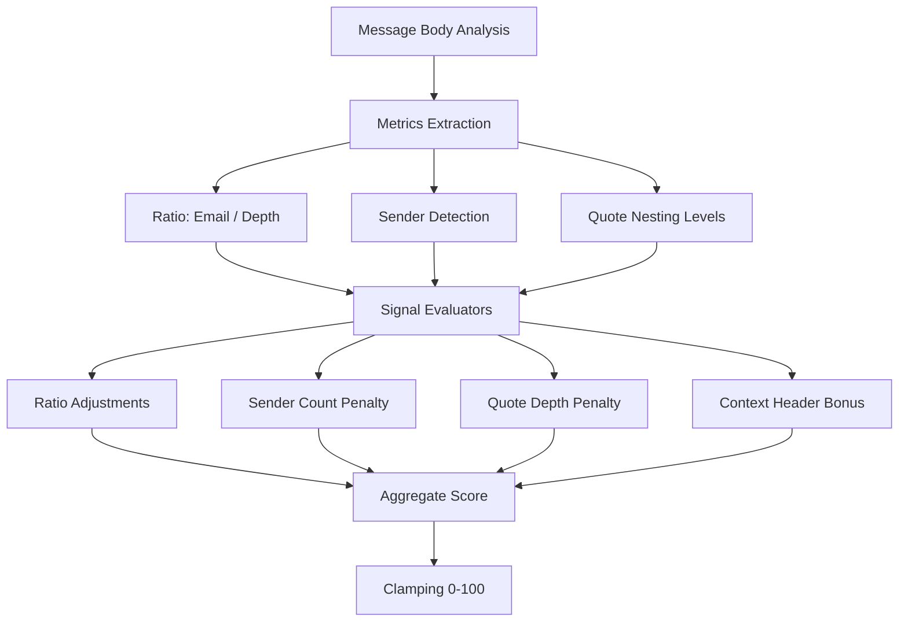

# Confidence Scoring System

The `email-origin-chain` library implements a specialized **Signal-Based Scoring System** to evaluate the reliability of detected email chains. This is particularly important for `inline` detection (text-based), where formatting can sometimes be ambiguous.

## ⚖️ Architecture

Instead of a single boolean check, the system evaluates several independent **Signals**. These signals can be positive (bonuses) or negative (penalties) and are aggregated into a final score from **0 to 100**.



## 📊 Available Signals

### 1. Ratio Signals (Base Score)
The ratio is calculated as `Detected Email Addresses / Detected Forward Depth`.

| Signal | Logic | Impact | Description |
| :--- | :--- | :--- | :--- |
| `penalty_ghost` | `email_count == 0` | -100 | The chain indicates a forward but no actual email addresses found. |
| `penalty_inconsistent` | `ratio < 0.5` | -100 | Extremely low density for the detected depth. |
| `adjustment_partial` | `0.5 <= ratio <= 1.5` | -50 | Likely a partial chain (e.g., only 1 email detected per level). |
| `adjustment_high_density` | `ratio > 2.4` | -75 | Very high density (many emails). Requires verification. |
| **Standard** | `1.5 < ratio <= 2.4` | +0 | **Optimal base score (100)**. Typical for From/To blocks. |

### 2. Validation & Penalties
These signals refine the base score based on visual or logical evidence.

| Signal | Condition | Impact | Description |
| :--- | :--- | :--- | :--- |
| `bonus_validated_density` | High density + >60% headers | +75 | Validates "High Density" chains if email addresses are preceded by headers like `To:` or `Cc:`. |
| `penalty_sender_mismatch` | `senders > depth` | -75 | Found more actual `From:` headers than recursion levels. Suggests a missed separator. |
| `penalty_quote_mismatch` | `quote_depth > depth` | -75 | Found nested `>` symbols deeper than the detected levels. Suggests hidden levels. |

## 🔍 Debugging & Transparency

The extraction result provides two fields for auditing the score:

1.  **`confidence_signals`**: A raw key-value pair of every triggered signal and its impact.
2.  **`confidence_reasons`**: A list of human-readable strings explaining each triggered signal.

### Example Suspect Result
```json
{
  "confidence_score": 25,
  "confidence_description": "Low Confidence: High Density: Ratio 5.00 is high (many emails per level); Unvalidated Density; Sender Mismatch: Found 2 senders but only 1 forward levels",
  "confidence_signals": {
    "adjustment_high_density": -75,
    "penalty_sender_mismatch": -75
  },
  "confidence_reasons": [
    "High Density: Ratio 5.00 is high (many emails per level)",
    "Unvalidated Density: Only 0% of emails have header context",
    "Sender Mismatch: Found 2 senders but only 1 forward levels"
  ]
}
```

## 🛠 Usage for Developers

You should typically flag results with `confidence_score < 50` for manual review, as they likely indicate "Garbage" chains or highly fragmented formatting that fooled the parser.
